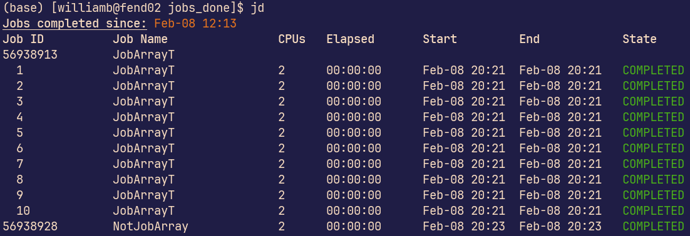

# slurm_jd

[](https://github.com/chem-william/slurm_jd/actions/workflows/check.yml)

A small program to list finished jobs on a SLURM queue system



## Installation

```sh
cargo install --git https://github.com/chem-william/slurm_jd
```

## Usage

```sh
# Jobs since last session (default)
jobs_done

# Jobs from the last 4 hours
jobs_done 4

# Jobs from today
jobs_done --day

# Jobs since a specific time
jobs_done --since 2025-01-01T00:00:00

# Filter by job state
jobs_done --state FAILED
jobs_done --state FAILED --state TIMEOUT

# Use as a specific user other than the default (which is your OS username)
jobs_done -u <username>
```

## Contributing

Contributions are welcome! Open a pull request to fix a bug, or [open an issue][]
to discuss a new feature or change.

Check out the [Contributing][] section in the docs for more info.

[Contributing]: CONTRIBUTING.md
[open an issue]: https://github.com/chem-william/slurm_jd/issues

## License

This project is licensed under the MIT license.

`slurm_jd` can be distributed according to the MIT license. Contributions
will be accepted under the same license.

## Authors

* [William Bro-Jørgensen](https://github.com/chem-william)
